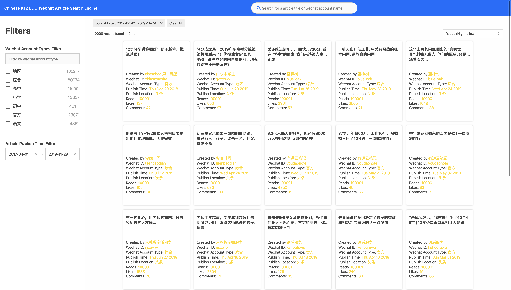
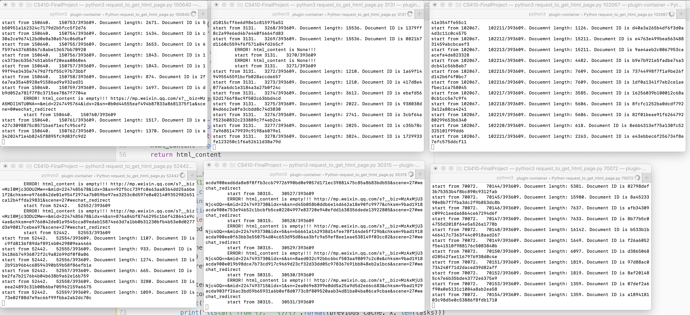

# K12_chinese_wechat_articles

[LIVE DEMO](http://3.14.12.231:8002/)

# Data crawling

## 1. Crawl large amounts of Metadata on xigua.com

## 2. HTML content crawling on weixin.qq.com

### 2.1. selenium crawler

### 2.2. chrome

## 3. Amazon Elasticsearch service engine setup

### 3.1. Amazon es service data populate

### 3.2. Dejavu debugging

# Frontend rendering

## 4. ReactiveSearch UI Component

## 5. Webpack technology
